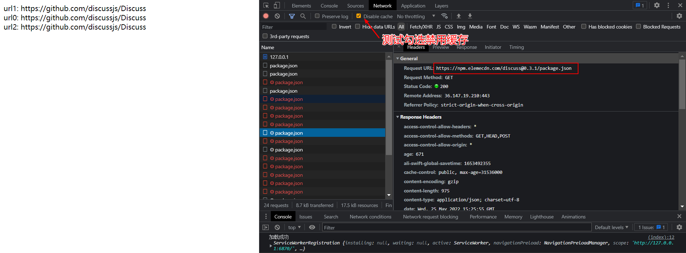
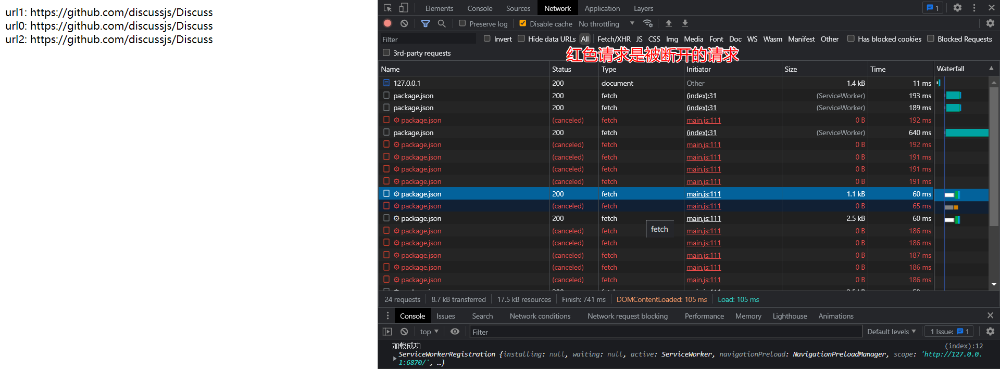

## 简介

今年 [jsdelivr](https://www.jsdelivr.com/) 频繁出现问题，导致众多使用 jsdelivr 的网站无法正常访问

对于一些内容较少的网站，只需少量修改即可完成，但对于内容较多的网站，入侵式调整网站的 **jsdelivr** 链接，使得迁移工作相当麻烦

甚至对于一些很少接触开发的站长来说，迁移工作可能会耗费很多时间

## 使用 Service Workers

> Hexo 插件: [hexo-sw-racing](https://github.com/Lete114/SW-Racing/tree/hexo)

> Service Workers 在本文统一叫 sw

关于 **Service Workers** 是什么？自行查看 [https://developer.mozilla.org/zh-CN/docs/Web/API/Service_Worker_API/Using_Service_Workers](https://developer.mozilla.org/zh-CN/docs/Web/API/Service_Worker_API/Using_Service_Workers)

关于 sw 的浏览器兼容性，市面上 **94%** 的浏览器都已经支持，具体以 [https://caniuse.com/?search=ServiceWorkers](https://caniuse.com/?search=ServiceWorkers) 为准

sw 可以拦截网站的所有请求，捕获并篡改请求，使用也是有要求的，必须是**HTTPS**协议，并且 sw 必须与当前**网站同源**

## 注册 sw

在你的网站插入如下 js，并将仓库中`sw.js`文件放到你网站的根目录

将安装代码放置在`<head>`之后

```html
<script>
  ;(function () {
    if ('serviceWorker' in navigator) {
      navigator.serviceWorker
        .register('/sw.js')
        .then((result) => {
          // 判断是否安装了sw
          if (!localStorage.getItem('installSW')) {
            localStorage.setItem('installSW', true)
            // 这里就不用清理setInterval了，因为页面刷新后就没有了
            const timer = setInterval(() => {
              // 判断sw安装后，是否处于激活状态，激活后刷新页面
              if (result && result.active && result.active.state === 'activated') {
                clearInterval(timer)
                location.reload() // sw注册后，会在下次访问时才工作，所以这里调用reload()刷新一次页面
              }
            }, 100)
          }
        })
        .catch((err) => {
          console.log(err)
        })
    }
  })()
</script>
```

## 注销 sw

直接删除`sw.js`文件并删除安装代码，新用户不会安装上 sw，但已经安装过的老用户 sw 则会继续正常运作，这将导致老用户可能访问不正常的 bug

所以正确的删除姿势是将注册的 sw 代码改为如下代码：

> 请保留注销 sw 代码在你的网站至少 3 个月或者更久的时间(代码体积小，且是异步代码，所以不会对你网站的渲染照成影响)

```js
if ('serviceWorker' in navigator) {
  navigator.serviceWorker
    .getRegistrations()
    .then((r) => {
      for (let i of r) i.unregister()
      console.log('注销成功')
    })
    .catch(() => console.log('注销失败'))
}
```

## 效果图



